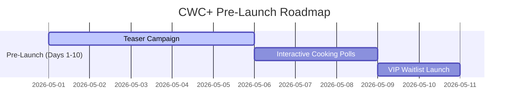

# 🚀 CWC+ GO-TO-MARKET & 30-DAY LAUNCH PLAN
**Elite Culinary Academy & Premium Recipe Platform Launch Playbook**

---

## 📅 PHASE 1: PRE-LAUNCH HYPING (Days 1–10)
*Goal: Build a massive waitlist, generate curiosity, and warm up the culinary community.*

### 1. The Teaser Campaign (Days 1–5)
*   **Action**: Publish 3 premium, highly cinematic teaser videos on Instagram Reels and TikTok.
*   **Hook**: *"Why do your home-cooked meals never taste like restaurant-grade dishes? The secret isn't the ingredients—it's the technique. Something massive is coming to revolutionize your kitchen."*
*   **Visual Style**: Extreme close-ups, slow-motion sizzling, high-contrast lighting, and epic transitions. No raw tutorials yet, just sensory overload.
*   **CTA**: *"Turn on post notifications. You won't want to miss Day 1."*

### 2. Interactive Cooking Polls (Days 6–8)
*   **Action**: Use Instagram Stories to run interactive polls.
*   **Prompts**:
    *   *“What is your #1 kitchen struggle? (A) Searing Steak, (B) Mastering French Sauces, (C) Perfect Pastry.”*
    *   *“Would you pay RM19.90/month to cook like a Michelin-starred chef? (A) Take my money! (B) Let me see the recipes first.”*
*   **Outcome**: Build high engagement, and use the responses as social proof in subsequent copywriting.

### 3. Launching the VIP Waitlist (Days 9–10)
*   **Action**: Redirect all bio links to a beautiful, distraction-free waitlist landing page.
*   **Offer**: *"Join the VIP Waitlist now. Get 20% lifetime discount on membership + a free 'Kitchen Knife Mastery' mini-class on launch day."*
*   **Trigger**: Use automated email marketing sequences to welcome them and set expectations.

---

## 🚀 PHASE 2: LAUNCH & CONVERSION (Days 11–15)
*Goal: Turn waitlist leads and warm traffic into recurring premium subscribers.*

### 1. Day 11: The Doors Open (The "Grand Reveal")
*   **Email Broadcast**: Send an epic, narrative-style email to the waitlist.
    *   **Subject**: `🚪 CWC+ is LIVE. (Your kitchen will never be the same)`
    *   **Body**: Introduce the platform, emphasize the TypeScript-powered elite user experience, show the premium recipes vault, and mention the Stripe-secured payment gateway.
*   **Social Push**: Live stream on Instagram showing a live platform walkthrough. Highlight the responsive design, spotlight pinnable masterclasses, and show how easy it is to unlock recipe cards.

### 2. Day 12–13: The Value Showcase
*   **Action**: Give a free "sneak peek" of a premium recipe or class.
*   **Execution**:
    *   Post a carousel showing 3 steps of a premium recipe (e.g., *Pan-Seared Salmon with Herb Butter Sauce*).
    *   Stop at the secret step.
    *   **CTA**: *"Unlock the exact temperature guide, full video tutorial, and interactive ingredients checklist on CWC+ now."*

### 3. Day 14–15: Urgency & Scarcity Play
*   **Action**: The lifetime VIP discount is closing.
*   **Social & Email Hook**: *"Only 24 hours left to secure your lifetime 20% discount. Prices increase tomorrow to the standard rate. Don’t cook with training wheels anymore."*

---

## 📈 PHASE 3: RETENTION & ADVOCACY (Days 16–30)
*Goal: Retain current subscribers, decrease churn, and leverage word-of-mouth.*

### 1. Weekly "Spotlight Masterclass" (Days 16–22)
*   **Action**: Pin a new class in the **Studio Control** as "Featured".
*   **Engagement**: Send a weekly newsletter every Friday morning highlighting the *“Chef’s Weekend Challenge”*. Encourage members to cook the dish and submit photos.

### 2. Member Showcase & Social Proof (Days 23–27)
*   **Action**: Repost photos of dishes cooked by members on official channels.
*   **Hook**: *"Look at what Sarah made in just 30 minutes after watching our Herb Crust Steak masterclass! Professional grade results, cooked at home."*
*   **Aesthetic**: Gives social validation and makes non-subscribers feel a heavy sense of FOMO (Fear of Missing Out).

### 3. Community Feedback Loop (Days 28–30)
*   **Action**: Conduct a quick survey via email or inside the user profile.
*   **Ask**: *"What class should we record next? (A) Japanese Ramen from Scratch, (B) Artisan Sourdough, (C) High-Protein Gourmet Mealprep."*
*   **Impact**: Proves to subscribers that the platform is active, responsive, and worth their monthly recurring subscription.

---

## 💰 HIGH-CONVERTING COPYWRITING TEMPLATES

### 📧 Email Campaign 1: The Waitlist Hook
> **Subject**: The secret to restaurant-grade food at home... 🤫
>
> Hey [First Name],
>
> Why does restaurant food always taste better?
>
> It’s not because they have exotic ingredients. And it’s not because they have magic stoves.
>
> It’s because they have **systems, precision, and proven techniques**.
>
> For the last few months, we’ve been building **CWC+**—a premium culinary library designed to take you from a home cook to a culinary master.
>
> **What you get inside CWC+:**
> *   🎬 **Cinematic Masterclasses** - Step-by-step video courses with zero fluff.
> *   📖 **Interactive Recipe Cards** - Responsive ingredients scaling and precise temperature charts.
> *   🎯 **Spotlight Challenges** - Cook alongside our community and master one major technique weekly.
>
> In 48 hours, the doors open. As a VIP waitlist member, you'll receive a **lifetime 20% discount** off our subscription.
>
> [👉 Join the VIP Waitlist Now]

---

### 📲 Instagram Caption: The Launch Day Push
> **Caption**:
> STOP COOKING BLIND! 🚫🍳
> 
> Ever wonder why your steak is unevenly cooked or your sauces split? You are missing the science of cooking.
> 
> Today, **CWC+** is officially LIVE. 🚀
> 
> We have unlocked the vault to our premium cooking masterclasses, elite recipe guides, and interactive tools designed to turn your kitchen into a 5-star restaurant.
> 
> 🔥 **LIFETIME 20% DISCOUNT IS ACTIVE NOW** for the next 48 hours only!
> 
> Link in bio to lock in your lifetime rate. Say goodbye to boring home-cooked meals forever.
> 
> #CulinaryAcademy #ChefMode #GourmetCooking #CWCPlus #HomeChef #CookingClass

---

## ⚡ 10 HIGH-IMPACT ACQUISITION HOOKS

1.  **"Stop guessing temperatures. Cook steak like a pro every single time."**
2.  **"The difference between a RM15 meal and a RM150 dish is 3 simple techniques. We teach you all three."**
3.  **"Unlock the exact culinary playbook used by elite chefs, directly in your home kitchen."**
4.  **"Ditch the generic YouTube tutorials. Get straight-to-the-point, high-definition culinary masterclasses."**
5.  **"CWC+ is not a recipe site. It is an engineering system for your kitchen."**
6.  **"Master the art of sauce making. Elevate every single dish with French classic techniques."**
7.  **"Spend less time cleaning and more time cooking with our optimized single-pan gourmet guides."**
8.  **"No more split emulsified sauces. Learn the thermodynamics of culinary chemistry."**
9.  **"Cook faster, cleaner, and with 10x the flavor profile."**
10. **"Your kitchen is a laboratory. Start treating it like one with CWC+."**
